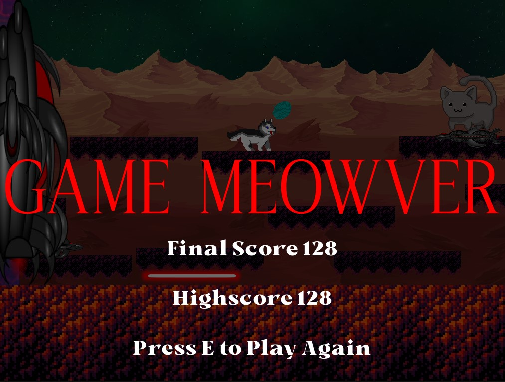

# Dog vs Space Cat

## Objective
The goal of the game is simple, survive against the cat and **Don't Get Hit**.

To stay alive you will need to dodge mutilple projectiles and an incoming wall.
### Projectiles
Each level adds a new projectile in the following order.
- **The Wall**: The wall appears on the left side of the screen and is constanly following you.
- **Yarn**: Yarn is the first projectile that appears when you start the game. The yarn is thrown from the cat to your location. It travels in a staight line and goes through platforms.
- **Bombs**: Bombs are the second projectile. Bombs fall from the sky and land on platforms. Once on a platform, they stop moving and act as a mine.
- **Lasers**: Lasers are the third projectile. Lasers only appear at the very bottom of the arena. Lasers go across the screen before repeating again.
- **Missiles**: Missiles are the fourth and last projectile. These missiles appear from the wall. They start out slow giving you a chance to see it's location. Once the missile leaves the wall, it rapidly travels in a straight line off the screen.

Although individually the projectiles seem easy to avoid, they become quite tricky to dodge when they come out all at once.

## Score
The in game score is based off of seconds. Each second your score increases by one. In this game score controls many aspects.

### Levels
Depending on your score, the levels are the following.
- Level 1: Score 0 - 10
- Level 2: Score 10 - 25
- Level 3: Score 25 - 45
- Level 4: Score 45 - 70

On the screen are trackers to help keep track of your score and level.

### Endless
Once level 4 is complete, you will enter into endless mode. Endless mode is like level 4 where all projectiles are active. The twist is that now **every 10 score** the speed of all projectiles **increases by 10%**.

The diffrence in speed may not seem like a lot, but in the hundreds of score, the speed really picks up pace.

### Highscore

Once the game is over, your score is displayed along with your highscore. This highcore remains constant until you get a new highscore. It creates something to aim for as you play and get better at the game.

## Gameplay
To help you dodge projectiles and get a high score, you have movement controls and abilities.

### Movement
- Jump: SPACE
- Move left: a
- Move right: d

### Ability
- Bark: LMB

Your bark might be the most useful tool while trying to get a high score. When you bark, the map gets cleared of projectiles for 2 seconds.

You need to use this ability wisely as there is a 20 second cooldown. There is an on screen tracker to help keep track of this cooldown.

## Work in Progess

Although I am happy with the final game, there are many aspects that can be improved.

- **Masking Images**: Sometimes the game will end while it looks like nothing hit you. I want to mask the sprites to add pixel perfect collision.
- **Projectile Movement**: Right now most of the projectile movements are basic. I want to find a way to maintain the difficulty while creating more interesting projectiles. Ex; yarn collisions with the platforms, bombs spinning, or homing missiles.
- **Stages**: It can get repetative playing with the same visuals everytime. I want to add new stages that include new backgrounds, enemies, projectiles, and moving platforms.
- **Abilities**: As of now there is only one ability and the game mainly revolves moving back and forth. I want to add more cool ways to survive like a double jump or a dodge.
- **Visuals**: Although something like the looks of the background or cat don't affect the gameplay, having a well looking game is just as important for enjoyability. I want to add screen shake at certain parts in the game and I want to make the cat have animations like physically throwing the yarn.
- **Dog Visuals**: The spritesheet I found for the dog I use contains many frames. I want to find way to incorporate more of these frames.
- **Sound Effects**: Without sound the game seems bland. I want to add sound effects for when you get hit or when you bark. Adding a soundtrack as you play would also improve the immersiveness of the game.
- **Overall Smoothness**: While playing the game, I encounter the visuals glitching sometimes. The most notable is if a bomb lands on the very edge of a platform, it might stop then countinue falling. I also found a weird occurance where if you are moving full speed the wall seems to slightly push the platforms.

## Enjoy!
Have fun with the game. If you want to do better than me, my highscore is 128.

### GOOD LUCK!
